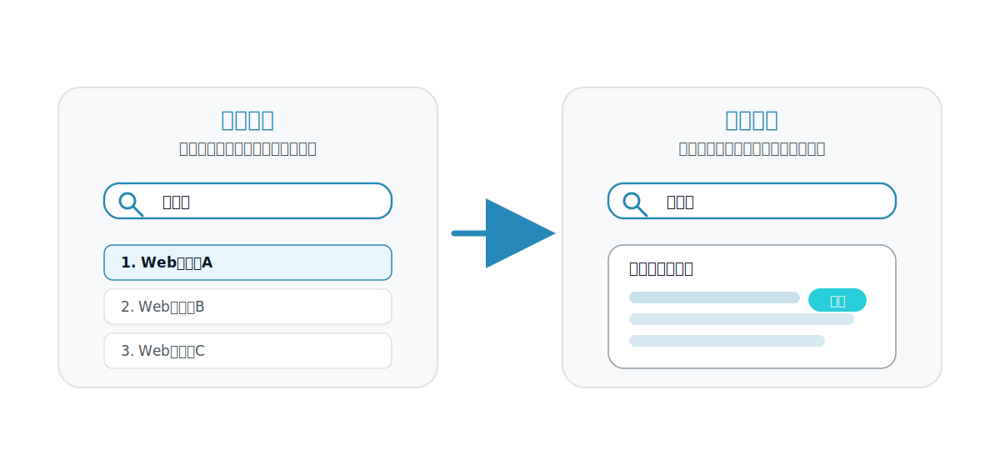
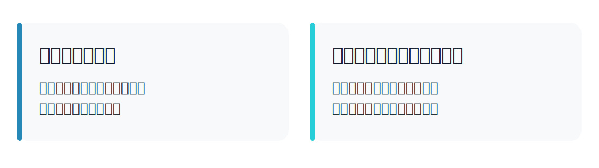
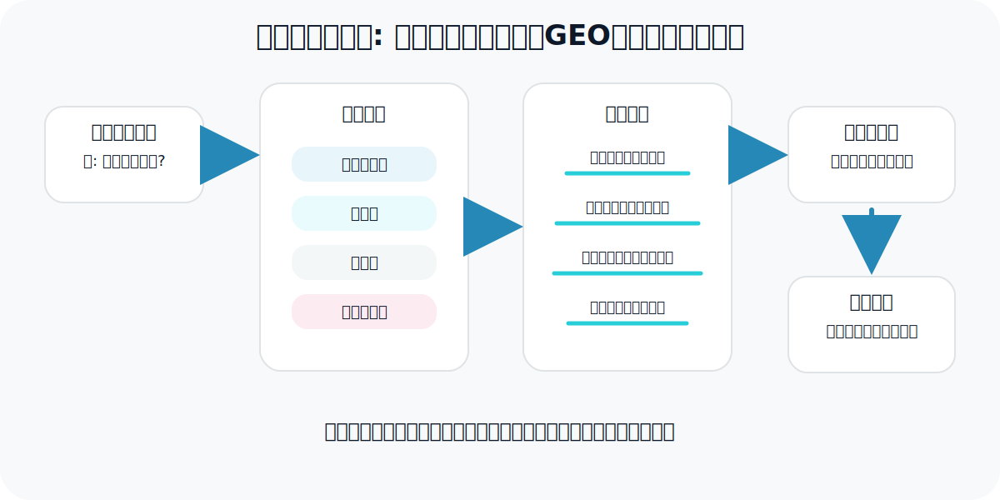
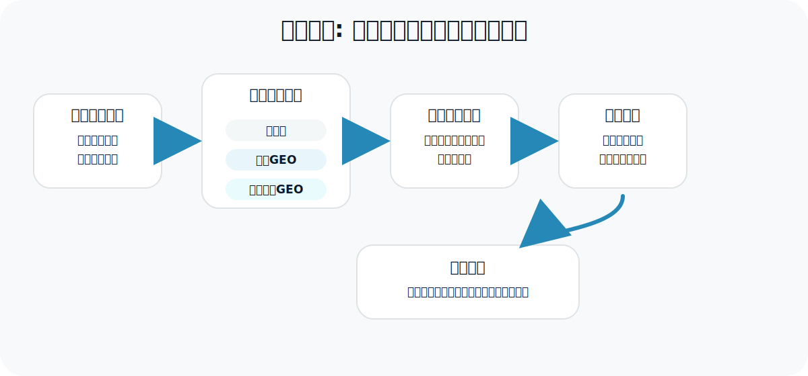

<!-- _class: title -->

# 日本語生成検索における 意図適応型GEOの提案

新美 昂正  
情報アーキテクチャ領域 / 稲村研究室

---

# 出発点: 検索で「見える場所」が変わった

---

# 生成検索では、順位だけでは不十分

従来のSEOでは、検索結果ページで**上位に表示されること**が中心だった。

生成検索では、ユーザが直接見るのは検索結果一覧ではなく、生成エンジンが統合した回答である。

つまり、Web文書は「検索結果にあるか」だけでなく、回答内で引用・要約されるかが重要になる。

---

# GEOとは何か

**GEO（Generative Engine Optimization）**は、生成検索エンジンの回答内でWeb文書の可視性を高めるための最適化である。

生成エンジン自体を変更するのではなく、入力される文書表現を最適化する。

---

# 関連研究: 既存GEOで分かっていること

Aggarwal et al. は、Web文書に9種類のGEO操作を適用し、生成回答内での可視性が変化することを示した。

| 分類 | 手法 | 内容 |
|---|---|---|
| 信頼性を足す | Cite Sources | 信頼できる出典・参照元を追加する |
| 信頼性を足す | Quotation Addition | 権威ある人物・資料からの引用句を追加する |
| 根拠を足す | Statistics Addition | 数値・統計・客観的な事実を追加する |
| 文体を変える | Authoritative / Fluency / Easy-to-Understand | 専門的・自然・平易な文体に変える |
| 語彙を変える | Technical Terms / Unique Words | 専門用語や多様な語彙を増やす |
| 従来SEO系 | Keyword Stuffing | クエリ関連キーワードを多く入れる |

---

# ただし、既存GEOをそのまま使うには課題がある

課題1: 日本語への適用

既存GEOは主に英語環境で評価されており、日本語文書でも同じ効果が出るかは未確認である。

課題2: 検索意図への適応

どのような質問に、どのGEO操作が有効かという対応関係は十分に整理されていない。

本研究は、この2つの課題を順に検証する。

---

# なぜ日本語では再設計が必要か

英語向けのGEO操作を日本語にそのまま移すと、文書変換と評価の両方でずれが生じる可能性がある。

文書表現の違い

- 語境界が明確ではない
- 主語省略が多い
- 敬体・常体の使い分けがある

評価指標の違い

- 英語の単語数評価をそのまま使いにくい
- 文字数・形態素・文単位への調整が必要
- 引用位置や要約利用量の定義が必要

---

# 本研究の問い

RQ1

既存GEO手法は、日本語生成検索でも対象文書の可視性を高めるか。

RQ2

検索意図ごとにGEO操作を切り替えることで、固定的なGEOより可視性を高められるか。

本研究の主張は、検索意図に応じてGEO操作を切り替える必要がある、という点にある。

---

# 提案: 意図適応型GEO

固定的に同じGEO操作を使うのではなく、検索意図ごとに操作を切り替える。

人手ラベル版で上限性能を確認し、ルールベース分類・LLM分類で実運用に近い条件も確認する。

---

# 検索意図はどう分類するか

| 検索意図 | 判定基準 | クエリ例 |
|---|---|---|
| 事実確認型 | 日付・定義・数値・固有事実を問う | 「○○はいつ開始されたか」 |
| 比較型 | 複数対象の違い・優劣・選択を問う | 「AとBの違いは何か」 |
| 解説型 | 概念や仕組みの理解を求める | 「○○とは何か」 |
| 意見・論点整理型 | 賛否・課題・論点を整理する | 「○○の是非は」 |

まず人手で分類基準を作成し、その後ルールベース分類とLLM分類を比較する。

---

# 意図ごとに有効な操作は異なるはず

| 検索意図 | 有効そうなGEO操作 |
|---|---|
| 事実確認型 | 出典追加、統計追加、日付・根拠の明示 |
| 比較型 | 比較軸の明示、表形式化、見出し構造化 |
| 解説型 | 流暢化、やさしい表現化、段階的説明 |
| 意見・論点整理型 | 引用句追加、権威化、論点整理 |

この対応関係が、固定GEOとの差を生むかを実験で確認する。

---

# 関連研究との位置づけ

生成検索では、質問に応じて検索・生成を変える研究が進んでいる。  
本研究は、その考え方を**文書最適化側**へ拡張する。

| 研究 | 位置づけ | 本研究との関係 |
|---|---|---|
| Self-RAG | 必要に応じて検索し、生成結果を自己反省する | 質問に応じて処理を変える発想 |
| RankRAG | 検索文脈の順位付けと回答生成を統合 | 質問に応じて使う文脈を選ぶ発想 |
| Evaluating Verifiability | 生成検索の引用の網羅性・正確性を評価 | 回答内引用の重要性を示す |
| G-Eval | LLMを用いたNLG評価 | 主観的品質評価の参考 |

---

# 実験の基本方針

検索結果文脈を固定し、対象文書のみを変換することで、文書表現の違いによる可視性変化を比較する。

---

# 実験対象とする生成検索環境

本研究では、実運用サービスを直接対象にする前に、再現可能なRAG型生成検索環境を構築する。

主実験

日本語クエリ → 5件の文書 → 1件のみGEO操作 → LLMで引用付き回答を生成 → 対象文書の利用度を評価

補助実験

実運用されている生成検索サービスでも一部比較し、再現環境で得た傾向が実環境でも見られるか確認する。

---

# 日本語クエリ・文書集合の設計

| 項目 | 設計案 |
|---|---|
| 検索意図 | 事実確認型、比較型、解説型、意見・論点整理型 |
| パイロット実験 | 4意図 × 10問 = 40問 |
| 本実験 | 4意図 × 50問 = 200問 |
| 文書集合 | 各クエリに対して5文書 |
| 対象文書 | 5文書中1件 |
| 文書順序 | 条件間で固定 |
| 生成回数 | 各条件3〜5回 |

まず小規模なパイロット実験で傾向を確認し、その後クエリ数と条件数を拡張する。

---

# 比較する条件

| 条件 | 内容 | 目的 |
|---|---|---|
| 無変換 | 元の日本語文書をそのまま使う | ベースライン |
| 既存GEO | 9種類の既存GEO操作を個別に適用 | 日本語環境での有効性を確認 |
| 固定GEO | 全クエリに同じGEO操作を適用 | 固定的な最適化の基準 |
| 意図適応型GEO | 検索意図ごとに操作を切り替える | 提案手法の有効性を確認 |

固定GEOの例: Cite Sources + Statistics Addition + Fluency Optimization

---

# 日本語向け可視性指標

| 指標 | 計算・確認方法 |
|---|---|
| 引用率 | 対象文書が回答中で1回以上引用された割合 |
| 引用シェア | 回答中の全引用のうち、対象文書への引用が占める割合 |
| 利用量 | 対象文書を引用する文の文字数・形態素数・文数 |
| 位置 | 対象文書が回答の何文目で初めて引用されたか |
| 日本語版Position-Adjusted Count | 回答前半に現れた対象文書由来の文ほど高く評価 |
| 主観的評価 | 関連性、影響度、独自性をLLM評価と一部人手評価で確認 |

---

# 評価で見ること

RQ1の検証

無変換と既存GEOを比較し、日本語環境で有効な操作と効きにくい操作を確認する。

RQ2の検証

固定GEOと意図適応型GEOを比較し、検索意図別最適化の有効性を確認する。

---

# 期待される貢献

1. 日本語生成検索におけるGEOの有効性と限界を明らかにする
2. 日本語向けの可視性評価指標を整理する
3. 検索意図とGEO操作の対応関係を実験的に示す
4. 生成検索時代の日本語Web文書最適化の設計指針を提案する

---

# 参考文献

- Aggarwal et al. “GEO: Generative Engine Optimization.” KDD 2024.
- Asai et al. “Self-RAG: Learning to Retrieve, Generate, and Critique through Self-Reflection.” ICLR 2024.
- Yu et al. “RankRAG: Unifying Context Ranking with Retrieval-Augmented Generation in LLMs.” NeurIPS 2024.
- Liu, Zhang, and Liang. “Evaluating Verifiability in Generative Search Engines.” Findings of EMNLP 2023.
- Liu et al. “G-Eval: NLG Evaluation using GPT-4 with Better Human Alignment.” EMNLP 2023.

---
## 固定GEOの課題と提案手法

### 固定GEOの課題
既存GEOは，文書に対して出典追加・統計追加・流暢化などを行うことで，
生成回答内での可視性を高める。

しかし，すべてのクエリに同じ操作を適用すると，
**クエリが求める回答形式と文書変換がずれる**可能性がある。

ミスマッチの例

- 比較クエリには比較軸が必要
- 事実確認クエリには根拠・出典が必要
- 解説クエリには平易な説明が必要
- 論点整理クエリには賛否・論点構造が必要

提案手法

**意図適応型GEO**

クエリの検索意図を分類し，
意図ごとに適したGEO操作を選択する。

**→ 固定的な変換ではなく，回答生成に必要な情報形式に合わせて文書を最適化する。**